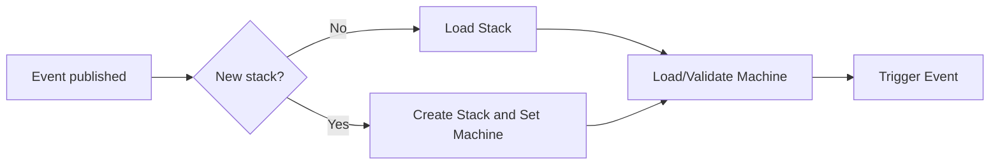
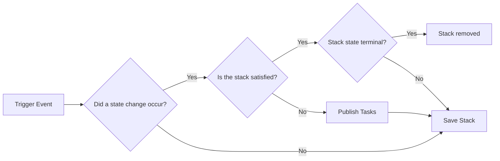

## State Machine Overview

A state machine is simply "a device which can be in one of a set number of stable conditions depending on its previous condition and on the present values of its inputs." They are especially useful when dealing with workflow and responding to external events. Instead of making this a comprehensive overview, here are a few links to additional resources:

- [Finite-state machine](https://en.wikipedia.org/wiki/Finite-state_machine) - Wikipedia article
- [State Pattern](https://en.wikipedia.org/wiki/State_pattern) - Wikipedia article
- [State Machine Design Pattern](https://www.researchgate.net/publication/251442299_State_Machine_Design_Pattern) - research paper published in 2006 from Anatoly Shalyto


## High-Level CloudSeam Overview

Before diving into the actual components, it's helpful to understand (at a high level) how CloudSeam works.

1. A message containing a stack ID, the desired machine definition (for new stacks), and the event to trigger on the state machine.
2. The requested machine definition is loaded and validated.
3. A new stack object is created and set to the `INIT` stage.
4. The requested event is triggered on the stack using the loaded state machine.




We'll dive into the various actions that can be triggered based on events in a moment. But before doing so, we'll finish up post-event handling. Once the event is processed by the state machine, the following occurs:

1. Did a state change occur? If so, the following occurs:
    - If the stack is not satisfied (has required task(s)), a task event is published for each required task.
    - If the current state is `terminal`, the stack is removed from persistence.
2. The stack state is stored in persistence.





### Handling Events

When responding to an event, your machine configuration will determine the actions to perform. You can transition to a new state, update stack metadata, or more. [Read more below...](#event-handling)

In addition, there are a few [system-defined events](#system-defined-events) to indicate task completion/failure, which are handled automatically.


## CloudSeam Machines

CloudSeam machines are simply state machines that are defined using YAML-based configuration, rather than code. The configuration defines the various states and all actions to be performed when events occur. 

Since each machine is driven by configuration, a single CloudSeam deployment can utilize multiple machine definitions. For example, you can deploy a feature app using machine 1 and deploy another feature app using machine 2. This is why each new stack is required to specify the machine it should use.

### States

Each state in the state machine allows configuration to determine how to respond to events.


### Event Handling

How your stack responds to events is completely up to you and how you define your machine specification. Currently, there are only two supported actions, `advance` and `no-op`. If a stack does not have an event handler for the incoming event, an error is thrown.

- If the event action type is `advance`:
    1. The stack's state is updated to the new state.
    2. If the new state has defined tasks, those tasks are added to the stack and task messages are sent. Upon completion of all tasks:
        - If the state is terminal, the stack is removed.
        - If the state is non-terminal, the `NEXT` event is triggered on the stack's current state (start over).
    3. If the stack has no tasks, the stack is in a stable state and waits for the next event.
- If the action is `no-op`, no action is completed. This is extremely helpful when simply wanting to update stack `metadata`.


### Tasks

One unique aspect of CloudSeam machines is that each stack can have a set of **tasks**. Tasks are jobs that need to be accomplished before advancing to the next step.

!!! example
    For a state machine being used to deploy a new environment, I might have a `PROVISION` stage that contains two tasks:

     - Provision a SSL certificate and associate it with the load balancer
     - Setup a database specifically for the stack

!!! important
    When all tasks for a stack are completed, the `NEXT` event is automatically fired. As such, all states with tasks are required to have a `NEXT` event handler.

## Stacks

State machines need to control the state of something. For CloudSeam, that something is a **stack**. A stack simply represents a single application environment. It might contain a database, a set of containers, logging, or whatever else you might need. 

You might even run multiple stacks within a single environment (like feature apps in a QA environment). In a scenario like this, each feature app is a stack, as that is the most granular element that needs to be controlled. You wouldn't spin up/down the entire QA VPC for a single stack deployment, but might share base infrastructure.

### Stack Attributes

Every stack has the following attributes:

- `id` - a unique name for the stack. Examples might be `master`, `feature-123`, `staging`, or even `prod`.
- `machine` - the machine specification driving the state machine for the stack
- `state` - the current state for the stack
- `previousState` - the previous state of the stack
- `metadata` - an arbitrary collection of metadata associated with the stack (see more below)


## Message Formats


There are two basic types of messages being sent through the system. By understanding their structure, you can craft your own messages and send them directly to test various situations.

- [Event Messages](#event-messages)
- [Task Messages](#task-messages)


### Event Messages

Event messages are either system or user generated events that invoke some sort of action on the state machine. 

#### Message Structure

Each messages are JSON objects that can contain the following:

- `stackId` (required) - the ID of the stack to act on
- `action` (required) - the action to perform/apply to the state machine
- `machine` (required on first appearance) - the name of the machine this stack should use. _MUST_ be provided on the first event for a stack, but not required on all subsequent events. Names are simply the YML filename, minus the `.yml` file extension.
- `metadata` (optional) - any arbitrary metadata to associate with the stack. The object _must_ be flat, so no nested objects/arrays. The metadata will be persisted with the stack and made available during task completion.


#### System-Defined Events

CloudSeam has several system-defined tasks are not included in your machine definition. 

!!! info
    Only the `NEXT` event is propogated to the stack. All others are handled external to the state machine itself. Therefore, only `NEXT` can be used within your machine spec.

- `NEXT` - an automatically-triggered event that is fired when all tasks are completed for a stack's current state
- `TASK_COMPLETED` - event published by the task satisfier upon completion of a task
- `TASK_ERROR` - event published by the task satisfier when a task fails. Also includes a description of the failure.
- `RETRY_FAILED_TASKS` - send task requests for all of the tasks currently marked as failed (typically only used for recovery/debugging)
- `RETRY_PENDING_TASKS` - send task requests for all pending tasks (typically only used for recovery/debugging)

#### Example Messages

The following message is the first event for a stack named `master`, so includes the required `machine` identifier. It also has additional metadata, which might represent a container image tag to be used later when running a container.

```json
{
    "stackId": "master",
    "machine": "qa-env",
    "action": "LAUNCH",
    "metadata": {
        "apiImageTag": "e724e901125e90eda014beb5fb7e6e9560e4153c"
    }
}
```

The following message will trigger the `DESTROY` event on the current state for the `master` stack.

```json
{
    "stackId": "master",
    "action": "DESTROY"
}
```


### Task Messages

Task messages are produced by the state machine and submitted to the task queue for completion.

#### Message Structure

Each messages are JSON objects that can contain the following:

- `task` (required) - the machine-specified configuration for the task
- `stack` (required) - current state for the stack being operated on. Contains the `name` and `metadata`, which can be used as desired by the 


#### System Actions

There are a few reserved actions, as noted in the [State Machine Overview](/state-machine-overview). As such, you may see log entries for events beyond just the ones you created yourself.


#### Example Message

The following message is a request to execute a Lambda function named `db-setup` to satisfy the `db-setup` task for the `master` stack. It has the same metadata from the previous `LAUNCH` event example.

```json
{
    "task": {
        "executor": "lambda",
        "config": {
            "name": "db-setup"
        },
        "name": "db-setup"
    },
    "stack": {
        "id": "master",
        "previousState": "INIT",
        "machine": "qa-env",
        "_state": "PROVISION",
        "tasks": [
            {
                "name": "db-setup",
                "status": "PENDING"
            }
        ],
        "metadata": {
            "apiImageTag": "e724e901125e90eda014beb5fb7e6e9560e4153c",
        }
    }
}
```
